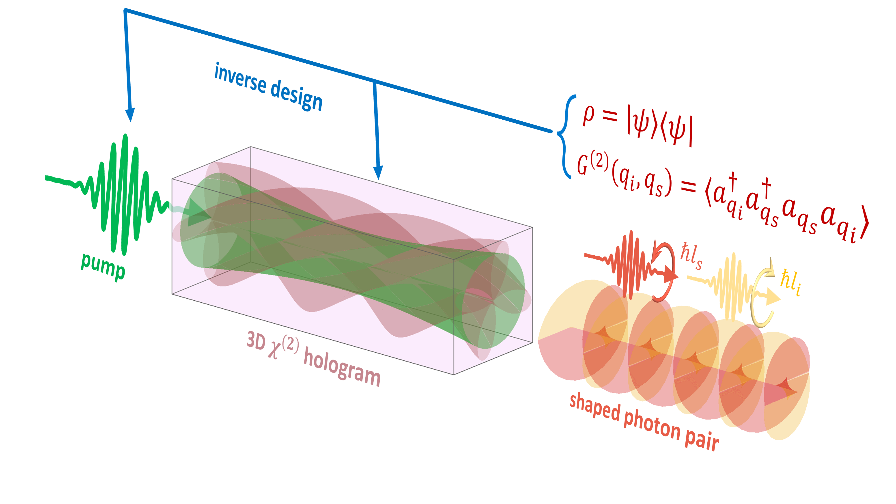

This repo contains the official implementation of the paper:

# Inverse Design of Spontaneous Parametric Down Conversion for Generation of High-Dimensional Qudits

## about
(**If you use the code, please _cite our paper_.**)
We have introduced an algorithm for solving the inverse design problem of generating structured and entangled photon pairs in quantum optics, using tailored nonlinear interactions in the SPDC process. The *SPDCinv* algorithm extracts the optimal physical parameters which yield a desired quantum state or correlations between structured photon-pairs, that can then be used in future experiments. To ensure convergence to  realizable results and to improve the predictive accuracy, our algorithm obeyed physical constraints through the integration of the time-unfolded propagation dynamics governing the interaction of the SPDC Hamiltonian.

### in this version
We have shown how we can apply our algorithm to obtain the optimal nonlinear $\chi^{(2)}$ volume holograms (2D/3D) as well as different pump structures for generating the desired maximally-entangled states. Using this version, one can further obtain all-optical coherent control over the generated quantum states by actively changing the profile of the pump beam.

## extensions
This work can readily be extended to the spectral-temporal domain, by allowing non-periodic volume holograms along the propagation axis -- making it possible to shape the joint spectral amplitude of the photon pairs. Furthermore, one can easily adopt our approach for other optical systems, such as: nonlinear waveguides and resonators, $\chi^{(3)}$ effects (e.g. spontaneous four wave mixing), spatial solitons, fiber optics communication systems, and even higher-order coincidence probabilities. Moreover, the algorithm can be upgraded to include passive optical elements such as beam-splitters, holograms, and mode sorters, thereby providing greater flexibility for generating and manipulating quantum optical states. The *SPDCinv* algorithm can incorporate decoherence mechanisms arising from non-perturbative high-order photon pair generation in the high gain regime. Other decoherence effects due to losses such as absorption and scattering can be incorporated into the model in the future. Finally, the current scheme can be adapted to other quantum systems sharing a similar Hamiltonian structure, such as superfluids and superconductors.

## Data Availability
Data underlying the results presented in this paper are available in `SPDCinv/Data availability/`.

## running the code
To understand and determine the variables of interaction and learning hyperparameters, see `src/spdc_inv/experiments/experiment.py` and read the documentation there (we will go into more detail here soon.)

Before you run the code, please run the following line from the bash: 
`export PYTHONPATH="${PYTHONPATH}:/home/jupyter/src"`
Later, run experiment.py by: 
`python src/spdc_inv/experiments/experiment.py`
